**TÀI LIỆU HƯỚNG DẪN SỬ DỤNG PHẦN MỀM**

**DÀNH CHO NGƯỜI QUẢN TRỊ HỆ THỐNG**

**Version 1.2.1**

*Hà Nội, 07/2024*

# **MỤC LỤC**

[I.	ĐĂNG NHẬP HỆ THỐNG	3](#_toc172185338)**

[II.	QUẢN LÝ TÀI KHOẢN	3](#_toc172185339)

[III.	QUẢN LÝ BÀI GIẢNG	8](#_toc172185340)

[IV.	TÀI LIỆU ĐÃ TẢI	18](#_toc172185341)

[V.	CÀI ĐẶT	19](#_toc172185342)

1. # **ĐĂNG NHẬP HỆ THỐNG** 

1. Người dùng truy cập vào apps (có kết nối Internet).
1. Nhập tên tài khoản (Tài khoản) và mật khẩu (Mật khẩu) đã được cấp.
1. Bấm “**Đăng nhập**”.

1. **QUẢN LÝ TÀI KHOẢN** 

1. Sau khi đăng nhập, người quản trị bấm vào danh mục “**Quản lý tài khoản”**, hệ thống sẽ hiển thị màn hình danh sách các tài khoản hiện có trên hệ thống cùng với các thông tin tài khoản:  *Số thứ tự, ảnh đại diện, tên tài khoản, tên đầy đủ, email, số điện thoại, địa chỉ, giới tính, quyền, trạng thái hoạt động và các thao tác (cập nhật, xoá tài khoản)*.

![ref1]

1. Các thao tác có thể thực hiện trong trang quản lý tài khoản như sau:

***TH1:** Đối với các tài khoản đã được tạo trên hệ thống, người quản trị có thể thao tác cập nhật tài khoản của người dùng theo các bước sau:*

**B1:** Chọn tài khoản cần cập nhật thông tin.

**B2:** Bấm nút “*Cập nhật*”, khi này hệ thống hiển thị ra khung thông tin tài khoản và người quản trị có thể sửa thông tin của tài khoản (*không bao gồm tên tài khoản*). 

**B3:** Sau khi thay đổi thông tin tài khoản, người quản trị ấn “*Xác nhận*” để hệ thống lưu thay đổi và cập nhật thông tin để hiển thị.

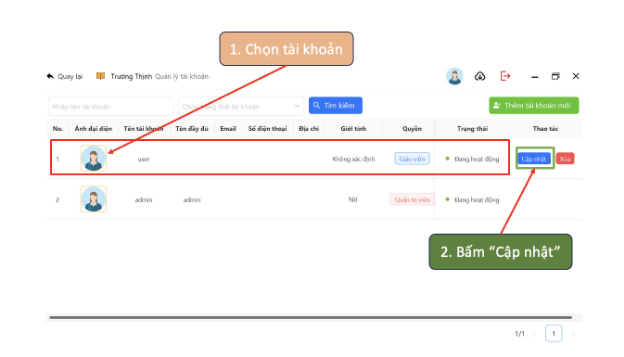

`	`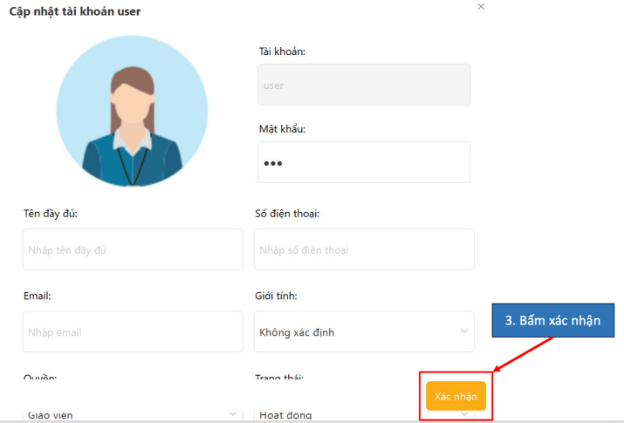

***TH2:** Người quản trị có thể xoá tài khoản người dùng theo các bước sau:*

**B1:** Chọn tài khoản cần xoá.

**B2:** Bấm nút “Xoá”. 

Sau khi xoá tài khoản, hệ thống sẽ cập nhật lại danh sách tài khoản (*không bao gồm tài khoản đã xoá*).

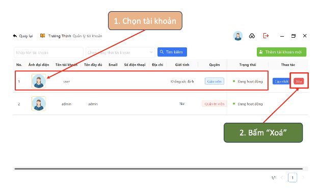

***TH3:** Người quản trị có thể “Thêm mới tài khoản” theo các bước sau:*

**B1:** Bấm nút “Thêm tài khoản mới” trên góc phải màn hình trang quản lý tài khoản.

**B2:** Hệ thống hiển thị khung để người quản trị thêm thông tin cho tài khoản mới. Tại đây, người quản trị tiến hành nhập thông tin tài khoản (không được bỏ trống tên tài khoản và mật khẩu) và bấm “*Xác nhận*”. Sau khi người quản trị xác nhận thêm tài khoản, hệ thống sẽ cập nhật thông tin và hiển thị tài khoản trên danh sách tài khoản trong trang quản lý tài khoản.

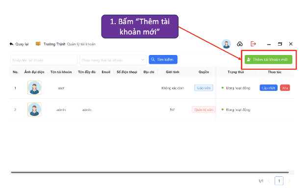

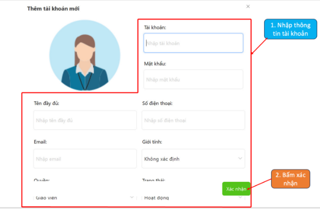

Ngoài ra, người quản trị cũng có thể tìm kiếm tài khoản dựa vào thanh công cụ tìm kiếm: tìm kiếm theo tên tài khoản (*nhập tên tài khoản --> bấm tìm kiếm*), tìm kiếm theo trạng thái tài khoản (*chọn trạng thái tài khoản --> bấm tìm kiếm*).

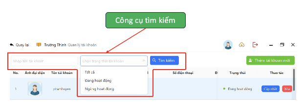

1. **QUẢN LÝ BÀI GIẢNG**

1. Sau khi đăng nhập, người quản trị bấm vào danh mục “**Quản lý bài giảng**” hệ thống sẽ hiển thị danh sách các bài giảng cùng với các thông tin: *Số thứ tự, tiêu đề, mô tả, tên file, loại file, kích thước file, thời gian cập nhật file, thông tin người tải file, trạng thái của file và các thao tác có thể thực hiện (xem trực tiếp, tải xuống, cập nhật, xoá file).*

![ref1]

1. Các thao tác có thể thực hiện trong trang quản lý bài giảng như sau:

***TH1:** Để “Thêm bài giảng mới”, người quản trị hệ thống có thể thực hiện theo các bước sau:* 

**B1:** Truy cập trang quản lý bài giảng.

**B2:** Bấm nút “Thêm bài giảng mới” ở góc bên phải trên cùng màn hình. Sau khi bấm “Thêm bài giảng mới”, hệ thống hiển thị khung thêm thông tin bài giảng. **B3:** Tiếp đó, người quản trị tiến hành nhập thông tin bài giảng vào khung.

**B4:** Sau khi nhập đầy đủ thông tin, người quản trị tiếp tục bấm nút “*Xác nhận*”. Sau khi bấm “*Xác nhận*” thông tin bài giảng sẽ được hệ thống lưu trữ và hiển thị trên màn hình trang quản lý bài giảng. 

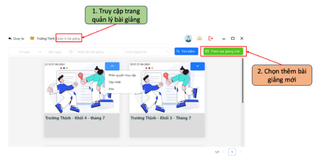

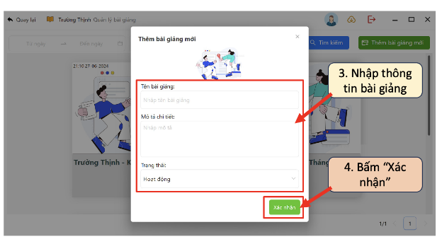

***TH2:** Mỗi bài giảng sẽ có một cách quản lý (tên bài giảng, người được phân quyền) khác nhau, vì vậy sau đây sẽ là các bước để quản lý từng bài giảng:*

**B1:** Truy cập trang quản lý bài giảng.

**B2:** Bấm nút xổ xuống để quản lý bài giảng. Lúc này một khung chức năng nhỏ sẽ hiển thị lên, bên trong sẽ bao gồm các thao tác người quản trị có thể quản lý từng bài giảng. 

- *Người quản trị chọn “phân quyền truy cập”:* Hệ thống hiển thị danh sách người dùng trên hệ thống để người quản trị có thể chọn phân quyền cho bài giảng. 

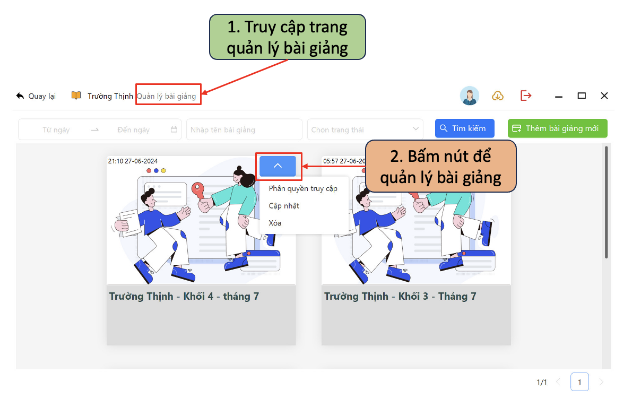

- *Người quản trị chọn “Cập nhật”:* Hệ thống hiển thị khung thông tin của bài giảng để người quản trị có thể chỉnh sửa thông tin. Sau khi thay đổi thông tin và bấm “Xác nhận” hệ thống sẽ cập nhật lại thông tin bài giảng và hiển thị trên trang quản lý bài giảng.

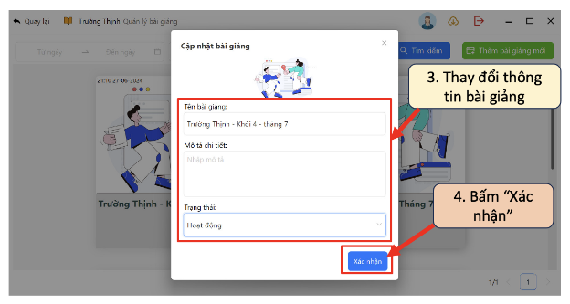

- *Người quản trị chọn “Phân quyền truy cập”:* Hệ thống hiển thị danh sách tài khoản để người quản trị có thể chọn tài khoản được truy cập vào bài giảng, sau đó người quản trị “bật” quyền truy cập và ấn nút “Xác nhận”. Sau khi xác nhận phân quyền, hệ thống sẽ tự động cập nhật quyền truy cập của từng tài khoản vào mỗi bài giảng khác nhau. 

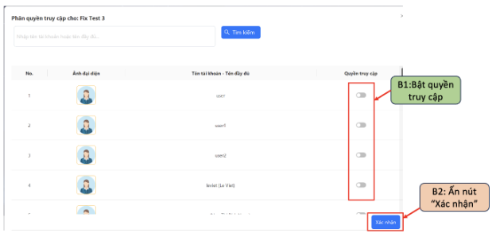

- Ngoài ra, người quản trị có thể tìm kiếm giáo viên (người dùng) để phân quyền truy cập cho mỗi bài giảng.

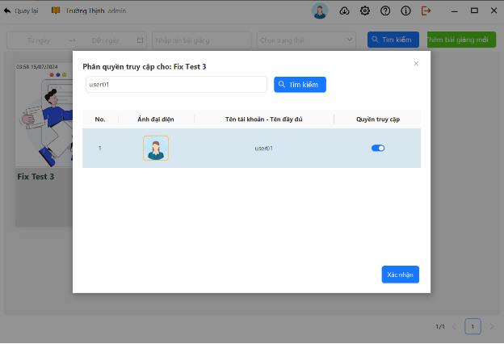

Trong mỗi “Bài giảng” sẽ có chứa nhiều file tài liệu. Khi truy cập vào mỗi “Bài giảng”, hệ thống sẽ hiển thị danh sách các file tài liệu. Tại đây, người quản trị có thể thực hiện các thao tác với file dữ liệu trong “Bài giảng”.

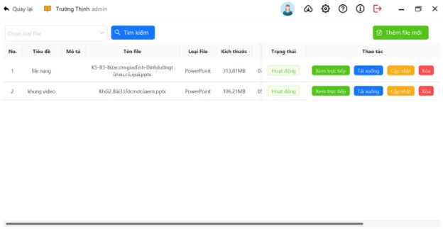

Mỗi file tài liệu sẽ bao gồm các thông tin chi tiết: *Tiêu đề, Mô tả, Tên file, Loại file, kích thước, Thời gian cập nhật, Người tải lên, Trạng thái (hoạt động, khoá)* kèm theo đó là các thao tác với file.

- Khi người quản trị chọn *“Thêm file mới”,* hệ thống sẽ hiển thị* khung thêm file tài liệu.

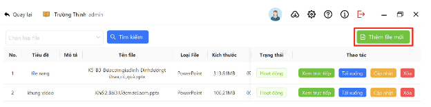

Tại khung thêm tài liệu, người quản trị lần lượt thực hiện theo các bước như hình. Sau khi thêm đầy đủ thông tin và xác nhận, file tài liệu sẽ được tải lên hệ thống. Khi hoàn tất quá trình này, file tài liệu sẽ được hiển thị trên danh sách file tài liệu của bài giảng cùng với đầy đủ các thông tin.

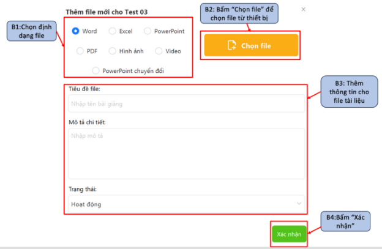

Khi người quản trị chọn *“Xem trực tiếp”,* cửa sổ hỗ trợ xem bài giảng trực tiếp sẽ hiển thị.

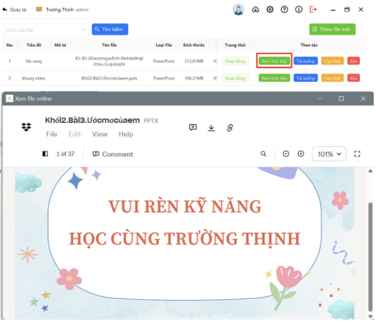

Khi người quản trị chọn *“Tải xuống”,* cửa sổ download file tài liệu sẽ hiển thị. Khi hoàn tất tải xuống, file tài liệu sẽ hiển thị trong danh mục *“Tài liệu đã lưu”*.

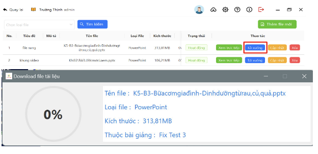

Khi người quản trị chọn *“Cập nhật”,* cửa sổ cập nhật thông tin file dữ liệu sẽ hiển thị. Tại đây, người dùng có thể thay đổi thông tin của file dữ liệu, sau đó ấn “Xác nhận” các thông tin thay đổi sẽ được hệ thống lưu lại và hiển thị.

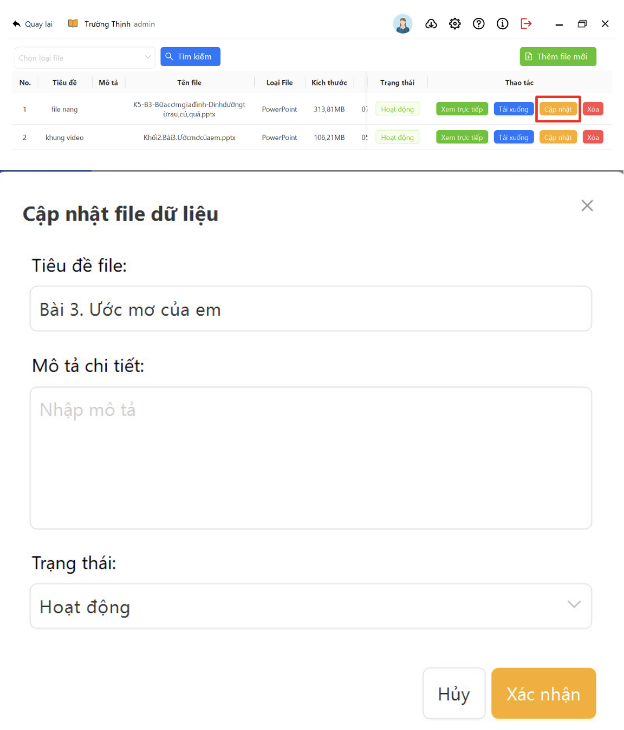

Khi người quản trị chọn *“Xoá”,* hệ thống sẽ xoá file dữ liệu.

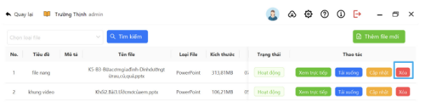

1. **TÀI LIỆU ĐÃ TẢI** 

Người dùng mở danh mục *“Tài liệu đã tải”*, hệ thống sẽ hiển thị danh sách file tài liệu mà người dùng đã tải xuống. Khi người dùng chọn tài liệu và bấm *“Xem”,* cửa sổ trình chiếu file tài liệu sẽ hiển thị. Khi này, người dùng có thể thực hiện các thao tác trình chiếu với file.

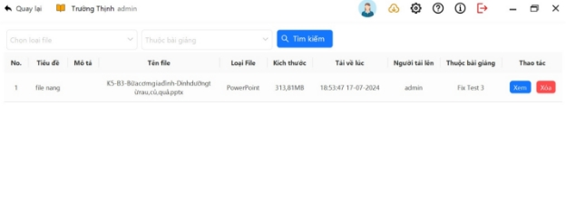

1. **CÀI ĐẶT** 
1. Cài đặt thông báo

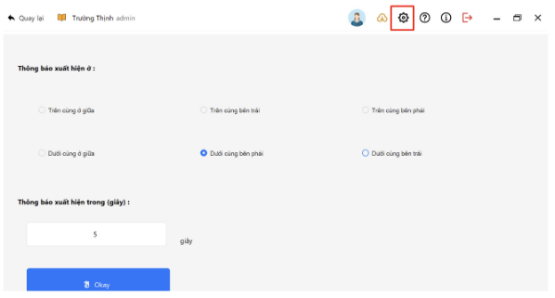

1. Cài đặt phiên bản của phần mềm

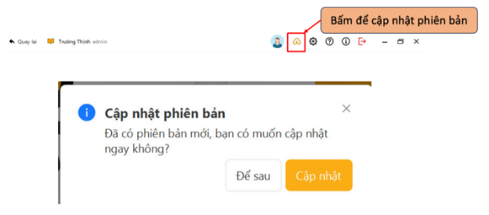

1. Đăng xuất 

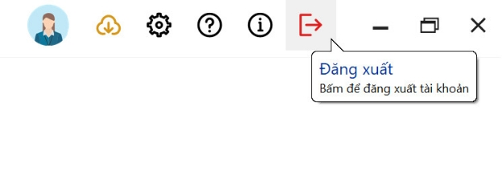

21

[ref1]: Aspose.Words.5438d069-e5a1-4f97-bdd4-2a296fa44fd9.002.png
