**TÀI LIỆU HƯỚNG DẪN SỬ DỤNG PHẦN MỀM**

**DÀNH CHO GIÁO VIÊN**

**Version 1.2.1**

*Hà Nội, 07/2024*

# **MỤC LỤC**

[I.	ĐĂNG NHẬP HỆ THỐNG	2](#_toc172203600)**

[II.	QUẢN LÝ BÀI GIẢNG	3](#_toc172203601)

[III.	HỒ SƠ CÁ NHÂN	5](#_toc172203602)

[IV.	CÀI ĐẶT	6](#_toc172203603)

1. # **ĐĂNG NHẬP HỆ THỐNG** 

1. Người dùng truy cập vào apps (có kết nối Internet).
1. Nhập tên tài khoản (Tài khoản) và mật khẩu (Mật khẩu) đã được cấp.
1. Bấm “**Đăng nhập**”.

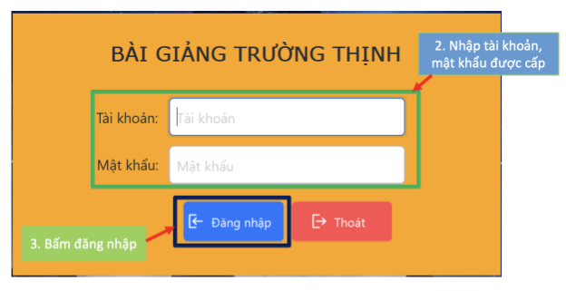

Sau khi đăng nhập hệ thống, màn hình của giáo viên sẽ được hiển thị như sau:

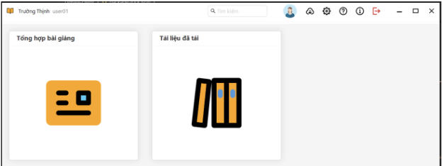

1. **QUẢN LÝ BÀI GIẢNG**

Giáo viên chọn danh mục *“Quản lý bài giảng”*, hệ thống sẽ hiển thị danh sách file tài liệu mà giáo viên được phân quyền truy cập. 

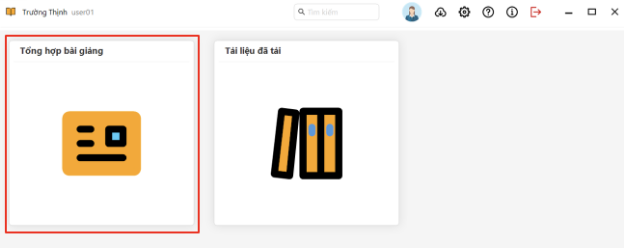

Tại đây, giáo viên có thể xem trực tiếp các file tài liệu hoặc tải về các bài giảng bằng cách bấm nút *“Tải xuống”* tương ứng với mỗi file tài liệu.

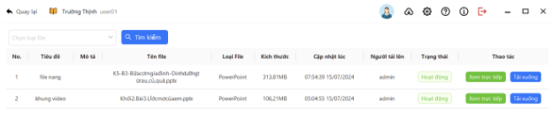

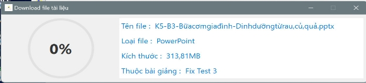

Khi giáo viên bấm *“Xem trực tiếp”,* hệ thống sẽ hiển thị khung cửa sổ trình chiếu trực tiếp tài liệu mà giáo viên muốn xem.

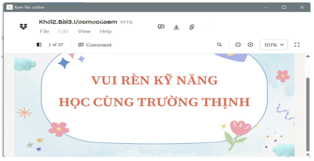

Sau khi hoàn tất tải xuống file tài liệu, giáo viên truy cập danh mục *“Tài liệu đã tải”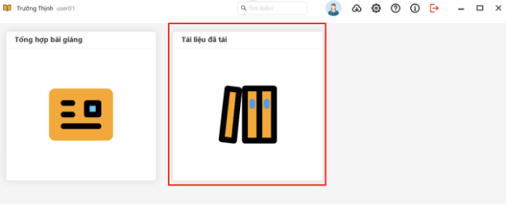* 

Tại đây hệ thống sẽ hiển thị danh sách các file tài liệu mà giáo viên đã tải về. Đối với mỗi file tài liệu, giáo viên có thể xem tài liệu và xoá tài liệu.

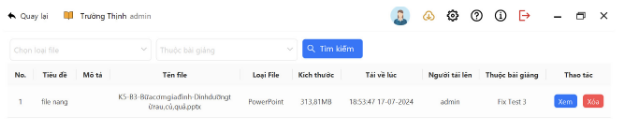

Sau khi bấm xem file tài liệu (ví dụ file định dạng .pptx) giáo viên có thể trình chiếu file tài liệu cùng với các hiệu ứng âm, hình ảnh,…

1. **HỒ SƠ CÁ NHÂN** 

Giáo viên có thể thay đổi các thông tin của tài khoản: *Mật khẩu, Tên đầy đủ, Số điện thoại, Email, Giới tính và Địa chỉ*. Những trường mặc định giáo viên không thể thay đổi bao gồm: *Tên tài khoản, Quyền, Trạng thái (hoạt động, ngừng hoạt động)*.

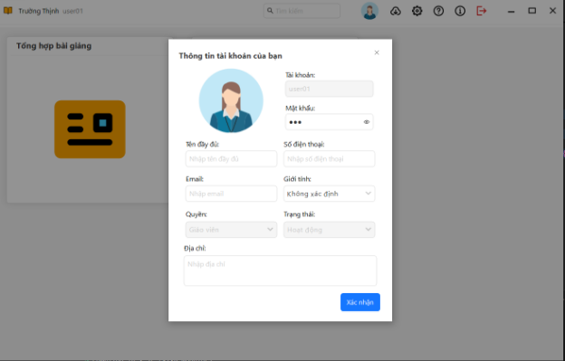

1. **CÀI ĐẶT** 
1. Cài đặt thông báo

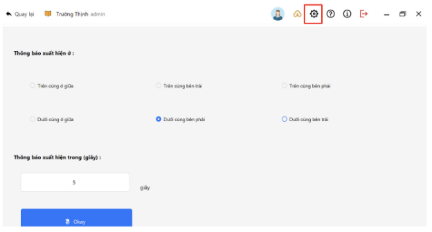

1. Cài đặt phiên bản của phần mềm

1. Đăng xuất 

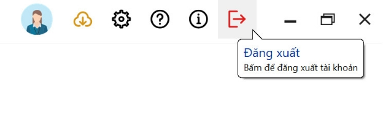

